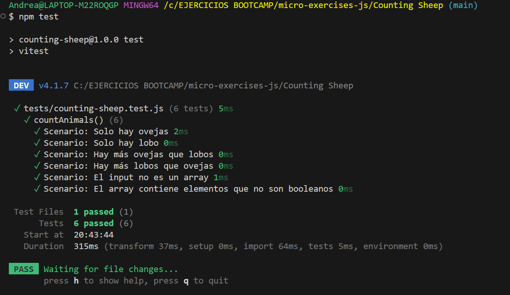

# Reto Counting Sheep - Desarrollo Guiado por Pruebas (TDD)

Este proyecto resuelve el reto de contar ovejas y lobos aplicando la metodología TDD (Test-Driven Development) utilizando Vitest como framework de pruebas.

## Escenarios Cubiertos

* **Escenario 1:** 
Retorna un mensaje con el total de ovejas cuando solo hay ovejas en la lista (ej. "There are 3 sheep in total").
* **Escenario 2:** 
Retorna un mensaje de advertencia si solo hay lobos en la lista (ej. "UPS!!! A pack of hungry wolves").
* **Escenario 3:** 
Retorna que las ovejas escaparon si hay más ovejas que lobos (ej. "4 sheep escaped!!!").
* **Escenario 4:** 
Retorna que los lobos se comieron a las ovejas si hay más lobos que ovejas (ej. "UPS!!! Wolves ate all the sheep").
* **Escenario 5:** 
Lanza un error si el dato proporcionado no es un array.
* **Escenario 6:** 
Lanza un error si el array contiene elementos que no son valores booleanos.

## Resultados de las Pruebas (Testing)

A continuación se muestra la captura de pantalla de la terminal con todos los escenarios validados y aprobados con éxito:

