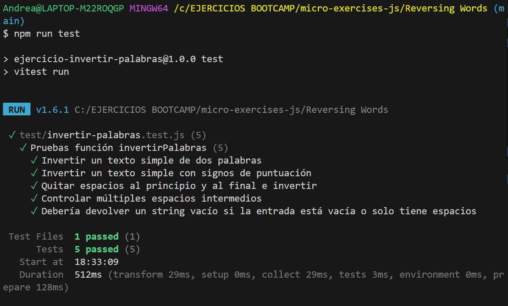

# Reversing Words

## Descripción
Función que recibe una cadena de texto y devuelve una nueva cadena donde el orden de las palabras se invierte por completo.

## Algoritmo
1. Recibir el texto original.
2. Dividir el texto en un array de palabras separadas por los espacios intermedios.
3. Invertir el orden de los elementos del array.
4. Volver a unir las palabras en una única cadena de texto separada por espacios.
5. Retornar el texto final invertido.

## Tests pasados con Vitest
