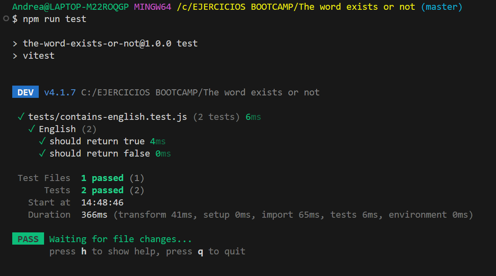

# The word exists or not

## 🔗 Enlace del Proyecto
Puedes ver el código de este ejercicio directamente en [GitHub](https://github.com/AndreaVaGo/micro-exercises-js/tree/main/The%20word%20exists%20or%20not).

## Descripción
Función que determina si una cadena de texto contiene la palabra "English",
sin importar si está en mayúsculas o minúsculas.

## Algoritmo

1. Recibir el texto
2. Convertirlo todo a minúsculas
3. Buscar si contiene "english"
4. Devolver true si está, false si no está

## Tests

